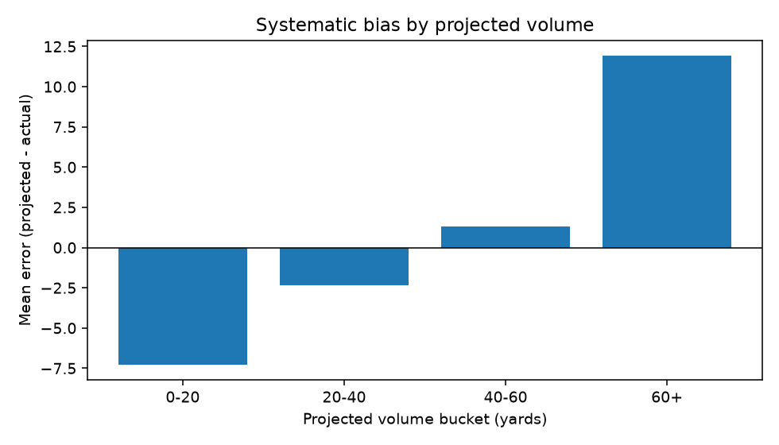
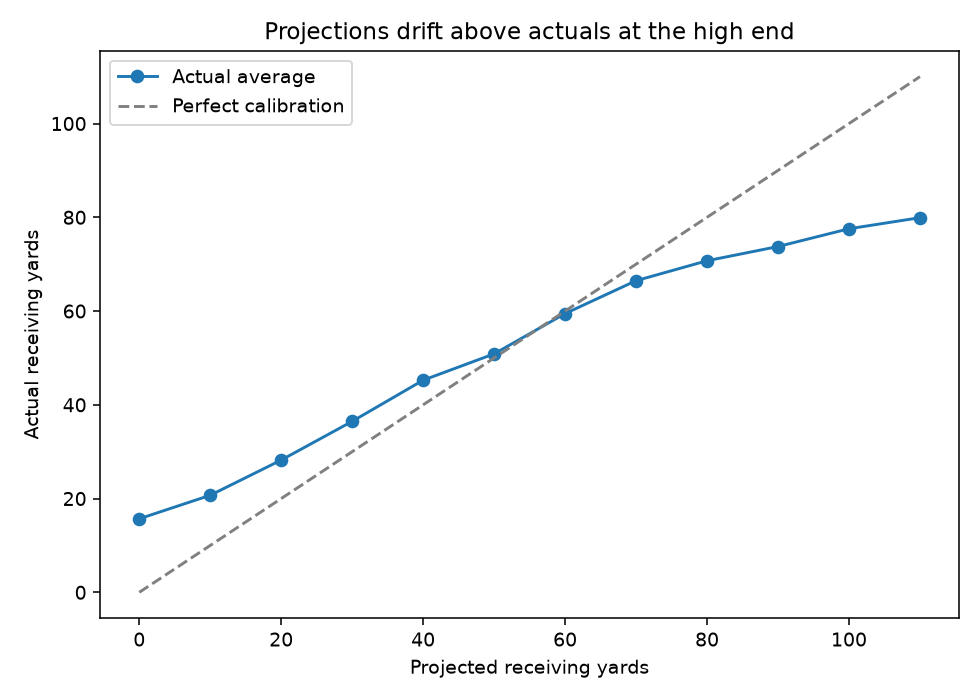

# NFL WR Receiving Yards — Projection Baseline

Projects weekly receiving yards for NFL wide receivers using only prior-week
data, backtested across seven seasons (2018–2024, 14,701 player-weeks). The
focus is on quantifying *where* the projections are wrong rather than only how
wrong they are.

## Finding

The rolling-average baseline is systematically biased by projected volume:



| Projected volume | n | MAE | Bias (proj − actual) |
|---|---|---|---|
| 0–20 yds | 3,379 | 15.59 | **−7.27** |
| 20–40 yds | 4,156 | 22.54 | −2.37 |
| 40–60 yds | 3,061 | 28.56 | +1.29 |
| 60+ yds | 3,088 | 36.30 | **+11.91** |

Receivers projected at 60+ yards are over-projected by roughly 12 yards per
game; those under 20 are under-projected by roughly 7. Overall bias is just
+0.46, so this is invisible without segmenting.

This is regression to the mean. Recent production isn't fully repeatable, and a
rolling average treats it as if it is. The calibration curve shows the same
thing — actual outcomes are flatter than projections, crossing the diagonal
around 58 yards:



A longer window also outperforms a shorter one, consistent with the same
explanation: short windows chase noise.

| Model | n | MAE | RMSE | Bias |
|---|---|---|---|---|
| 3-game rolling | 13,686 | 26.09 | 35.03 | +0.35 |
| 5-game rolling | 13,686 | 25.28 | 33.65 | +0.46 |
| **8-game rolling** | 13,686 | **24.81** | **32.82** | +0.63 |
| Career average | 13,686 | 25.24 | 32.90 | +1.53 |

I also checked whether error varied by week of season. It doesn't — MAE stays
between 24.7 and 27.3 across weeks 1–8 with no trend.

## Data

[nflverse](https://github.com/nflverse/nflverse-data) weekly player stats,
2018–2024. Filtered to wide receivers, regular season, valid opponent.

Distribution notes: mean 39.2 yards, median 30.0, max 269, min −13 (a reception
behind the line of scrimmage). 1,743 of 14,701 rows are zero-yard weeks.

## Method

Projections are rolling averages of a player's prior games, computed with
`.shift(1)` applied before the rolling window so that the projection for week N
depends only on weeks before N. Players need at least two prior games before
being projected, which reduces the evaluated set from 14,701 to 13,686 rows.

Evaluation uses MAE, RMSE, and mean signed error (bias), reported overall and
segmented by projected volume and by week of season.

## Limitations

- Zero-yard weeks can't be distinguished from weeks a player didn't play. About
  12% of rows are affected.
- No opponent adjustment — defensive strength is not controlled for.
- No injury, weather, snap-count, or depth-chart context.
- MAE rises with volume partly as a scale effect; percentage error would
  separate that from genuine degradation.
- Single position, single stat. Findings may not generalize to RB or TE.

## Running it

```bash
pip install -r requirements.txt
python src/fetch_data.py       # download and cache nflverse data
python src/build_dataset.py    # SQL cleaning into a WR player-week table
python src/project.py          # rolling-average projections
python src/evaluate.py         # error metrics and segment breakdowns
python src/charts.py           # figures
```

Raw data is not committed; `fetch_data.py` retrieves and caches it.

## Next

Shrink projections toward a positional mean to correct the volume bias, and add
opponent defensive strength. A gradient-boosted model would be the natural
comparison against this baseline.
